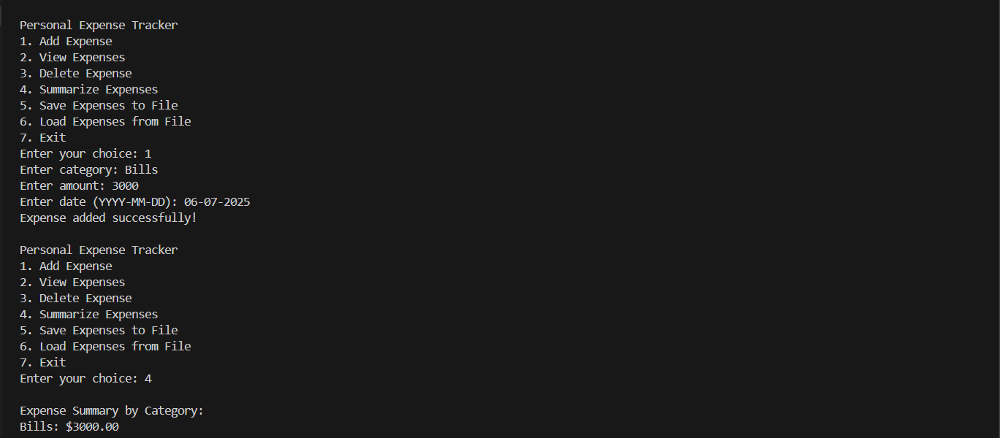

# Personal Expense Tracker 💰

A simple, interactive C++ console application to manage your personal expenses efficiently.

## 🚀 Features

- Add a new expense with category, amount, and date
- View all saved expenses
- Delete specific expenses
- Summarize expenses (total amount, category-wise summary)
- Save expenses to a file
- Load expenses from a file
- Easy-to-use menu-driven interface

## 🖼️ Preview

## 🛠️ Tech Stack

- C++
- File Handling
- Standard Template Library (STL)

## 📄 License

This project is open source and available under the MIT License.

